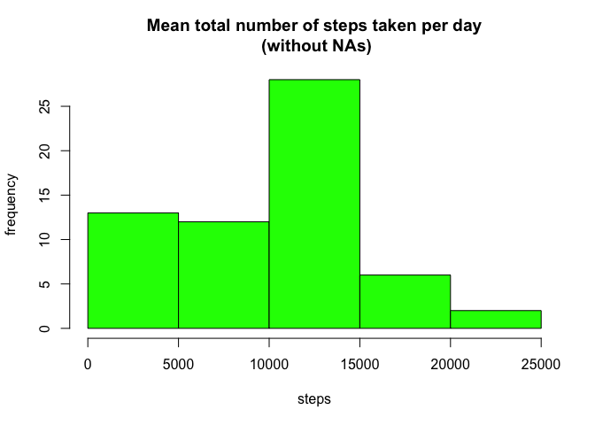

# Reproducible Research: Peer Assessment 1


## Loading and preprocessing the data


```r
data <- read.csv("activity.csv")
summary(data)
```

```
##      steps                date          interval     
##  Min.   :  0.00   2012-10-01:  288   Min.   :   0.0  
##  1st Qu.:  0.00   2012-10-02:  288   1st Qu.: 588.8  
##  Median :  0.00   2012-10-03:  288   Median :1177.5  
##  Mean   : 37.38   2012-10-04:  288   Mean   :1177.5  
##  3rd Qu.: 12.00   2012-10-05:  288   3rd Qu.:1766.2  
##  Max.   :806.00   2012-10-06:  288   Max.   :2355.0  
##  NA's   :2304     (Other)   :15840
```


## What is mean total number of steps taken per day?


```r
meanDay2 <- with(data, tapply(steps, date, sum))

hist(meanDay2, 
        xlab = "Steps", 
        ylab = " ", 
        main = "Mean total number of steps taken per day",
        col = "blue")
```

 

*Mean and median*

```r
mean(meanDay2, na.rm = TRUE)
```

```
## [1] 10766.19
```

```r
median(meanDay2, na.rm = TRUE)
```

```
## [1] 10765
```


## What is the average daily activity pattern?

```r
meanInterval2 <- with(data, tapply(steps, interval, mean, na.rm = TRUE))


forP <- data.frame(unique(data$interval), meanInterval2)
ind = 0
iMax <- max(forP[, 2]) 
for (i in seq_along(unique(data$interval)))
        if (forP[, 2][i] == iMax) ind <- forP[, 1][i]

plot(forP[, 1], forP[, 2], type = "l")
points(ind, iMax, col = "red")

infS1 <- paste("Interval number", ind, sep = " ")
infS2 <- paste(ceiling(iMax), "steps", sep = " ")
        
text(ind, iMax, paste(infS1, infS2, sep = "\n"), cex=0.5, pos=4, col="red")
```

 

```r
paste(infS1, infS2, sep = ", ")
```

```
## [1] "Interval number 835, 207 steps"
```

## Imputing missing values


```r
# 1. count missing values
paste("Total number of missing values:", sum(is.na(data$steps) == TRUE), sep = " ")
```

```
## [1] "Total number of missing values: 2304"
```

```r
# 2. 3. Imputting day averages instead of missing values
meanDay <- replace(meanDay2, is.na(meanDay2), 0)

data2 <- data
for (i in 1:length(data2[, 2])) 
        if (is.na(data2[ , 1][i])) 
                data2[, 1][i] <- meanDay[data2[, 2][i]]
#Any NAs?
summary(data2)
```

```
##      steps                date          interval     
##  Min.   :  0.00   2012-10-01:  288   Min.   :   0.0  
##  1st Qu.:  0.00   2012-10-02:  288   1st Qu.: 588.8  
##  Median :  0.00   2012-10-03:  288   Median :1177.5  
##  Mean   : 32.48   2012-10-04:  288   Mean   :1177.5  
##  3rd Qu.:  0.00   2012-10-05:  288   3rd Qu.:1766.2  
##  Max.   :806.00   2012-10-06:  288   Max.   :2355.0  
##                   (Other)   :15840
```

```r
# Thanks, no!

# 4.
meanDay3 <- with(data2, tapply(steps, date, sum))

hist(meanDay3, 
        xlab = "Steps", 
        ylab = " ", 
        main = "Mean total number of steps taken per day\n (without NAs)",
        col = "green")
```

 

```r
mean(meanDay3, na.rm = TRUE)
```

```
## [1] 9354.23
```

```r
median(meanDay3, na.rm = TRUE)
```

```
## [1] 10395
```

## Are there differences in activity patterns between weekdays and weekends?


```
## 
## Attaching package: 'dplyr'
## 
## The following object is masked from 'package:stats':
## 
##     filter
## 
## The following objects are masked from 'package:base':
## 
##     intersect, setdiff, setequal, union
```

```
## [1] "en_US.UTF-8/en_US.UTF-8/en_US.UTF-8/C/en_US.UTF-8/ru_RU.UTF-8"
```


```r
data2$wdFactor <- weekdays(as.Date(data2$date), abbreviate = TRUE)
data2$wdFactor <- replace(data2$wdFactor, data2$wdFactor %in% c("Sun", "Sat"), "weekend")
data2$wdFactor <- replace(data2$wdFactor, data2$wdFactor %in% c("Mon", "Tue", "Wed", "Thu", "Fri"), "weekday")

data3 <- group_by(data2, interval, wdFactor) %>%
                                summarise_each(funs(mean))

xyplot(steps ~ interval | wdFactor, data = data3, layout = c(1, 2), type = "l", col = "blue")
```

 
